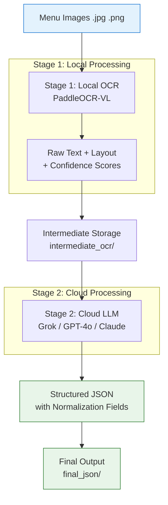

# Menu Extraction Pipeline Architecture

## Overview
A **Two-Stage Hybrid Pipeline** for converting restaurant menu images into structured JSON.



### Why This Two-Stage Pipeline Works Well

**Stage 1: Local VLM (OCR + Layout Extraction)**
Extracts raw text, layout, tables, reading order, etc. with high accuracy.
Runs offline → zero cost, full privacy, no rate limits.
Handles dense menus better than pure cloud vision in many cases.

**Stage 2: Cloud LLM (Grok / GPT-4o / Claude)**
Takes the clean raw structured text + layout from Stage 1.
Applies intelligence to map it into your exact JSON schema (with normalization fields, canonical names, dietary tags, etc.).
Much more reliable and cheaper than sending raw images.


This hybrid gives you the best of both worlds: high accuracy + structured output.

- Create a complete two-stage pipeline script (Local VLM Stage 1 + Cloud LLM Stage 2)?
- Focus on one specific model (e.g., PaddleOCR-VL or Nanonets-OCR2) with full setup instructions?

### Pipeline Flow

Input → Restaurant menu images
Stage 1 (Local) → PaddleOCR-VL extracts text with layout awareness
Intermediate → Saves raw OCR for debugging/reuse
Stage 2 (Cloud) → LLM converts raw text into your exact schema
Output → High-quality structured JSON with normalization fields

### Benefits of This Architecture

Privacy — Sensitive images processed locally in Stage 1
Cost Efficient — Only final structuring uses paid LLM
Reliable — Best OCR + Best reasoning combined
Reproducible — Models cached locally
Debuggable — Intermediate OCR files available

### Recommended Model for Stage 1: PaddleOCR-VL (0.9B)
### Why PaddleOCR-VL?

* Extremely fast and lightweight
* Excellent at document layout, tables, and reading order
* Strong multilingual support (very useful for Indian + Japanese menus)
* Easy to run locally

## Setup Instruction
### Install dependencies
```
pip install paddleocr paddlepaddle tqdm python-dotenv openai
```

### Environment Variables (.env) 

XAI_API_KEY=xai-...
\# OPENAI_API_KEY=...

### Project Structure
<pre>
menu-extraction-project/
├── menu_images/              ← Place all your menu images here
├── models/
│   └── paddleocr/            ← Auto-downloaded models (custom directory)
├── intermediate_ocr/         ← Raw OCR output from Stage 1
├── final_json/               ← Final structured JSON files
├── menu_extraction_pipeline.py
├── .env
├── requirements.txt
└── README.md
  
</pre>

### Model Download location and configuration

- PaddleOCR does download models to your local machine automatically.
**Details**:
On the first run (when you do PaddleOCR(...)), if you don’t specify custom model paths (det_model_dir, rec_model_dir, etc.),
it will automatically download the required models from the internet.
After downloading, the models are cached locally and reused in future runs — so it only downloads once.

- Where are the models downloaded?
Default Location:
```
Linux / macOS: ~/.paddleocr/
Windows: C:\Users\YourUsername\.paddleocr\
```

### How to run the application

```
export PROVIDER=grok
export XAI_API_KEY=xai-...
python3 menu_extraction_pipeline.py

```

